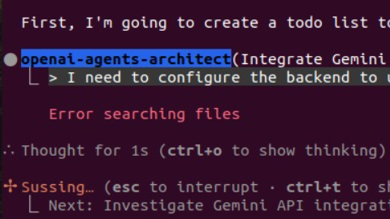
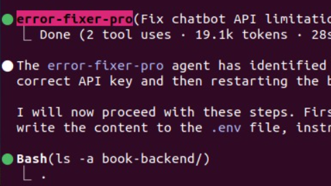
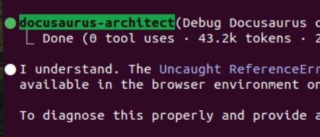
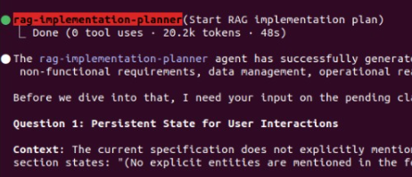

# Neurobotics AI Book Application

Welcome to the Neurobotics AI Book Application! This project features a robust backend providing AI capabilities and a user-friendly frontend built with Docusaurus, designed to deliver an interactive and personalized book experience.

## 🚀 Demo Video

[](https://www.youtube.com/watch?v=YOUR_YOUTUBE_VIDEO_ID)
*(Please replace `YOUR_YOUTUBE_VIDEO_ID` with the actual ID of your YouTube demo video.)*

## ✨ Features

This application is packed with modern features to enhance user interaction and content delivery:

### Chatbot
*   **Floating Icon**: Fixed bottom-right corner with smooth animations.
*   **Resizable Chat Window**: Toggle between small and large sizes.
*   **Chat History**: Persistent conversation history per session.
*   **Scrollable Messages**: Auto-scroll to latest messages.
*   **Real-time Responses**: Powered by Gemini AI model for dynamic interactions.
*   **Voice Input**: Send messages using voice (mock implementation, ready for integration).
*   **Text Copy**: Easily copy any message to the clipboard.
*   **Ask AI**: Enhanced AI help mode for detailed explanations.
*   **Responsive Design**: Optimized for both desktop and mobile devices.

### Core Application
*   **Multilingual Support**: Comprehensive framework for managing content in multiple languages, including community translation features.
*   **User-Centric Content Personalization**: Tailored content experiences based on user preferences and interactions.
*   **Secure User Authentication**: Robust authentication system for user management.
*   **RAG (Retrieval Augmented Generation) Integration**: Leverages knowledge bases for more informed and detailed AI responses.
*   **Content Management**: Tools for ingesting and managing book content.

## 🏛️ Architecture

The application follows a modern microservices-oriented architecture:

*   **Frontend**: Built with **Docusaurus** and React, providing a fast, interactive, and visually appealing user interface. Deployed on **Vercel**.
*   **Backend**: Developed with **FastAPI** (Python), serving as the core AI processing and data handling layer. Deployed on **Google Cloud**.
*   **AI Model**: Utilizes the **Gemini AI model** for real-time natural language processing and content generation.
*   **Databases**:
    *   **Qdrant**: A vector database used for efficient similarity search, crucial for RAG functionalities and personalization.
    *   **Neon**: A serverless Postgres database, handling persistent data storage for user profiles, content, and application data.

## 🚀 Deployment

*   **Frontend Deployment**: The Docusaurus frontend is continuously deployed and hosted on **Vercel** for optimal performance and scalability.
*   **Backend Deployment**: The FastAPI backend is deployed on **Google Cloud**, leveraging its robust infrastructure for AI model serving and API management.

## 🛠️ Setup and Installation

### Prerequisites

*   Python 3.9+
*   Node.js (LTS recommended)
*   `uv` (Ultrafast Python package installer)
*   `npm` or `yarn`

### 1. Backend Setup

```bash
# Navigate to the backend directory
cd book-backend

# Install Python dependencies
uv sync

# Set up environment variables
# Create a .env file and add your sensitive keys.
# Example .env content:
# GEMINI_API_KEY=your_gemini_api_key_here
# QDRANT_API_KEY=your_qdrant_api_key_here
# QDRANT_URL=your_qdrant_url_here
# NEON_DATABASE_URL=your_neon_database_url_here

# Run the backend server locally
uv run python main.py
# The API will be available at http://localhost:8000
```

### 2. Frontend Setup

```bash
# Navigate to the frontend directory
cd book-frontend

# Install Node.js dependencies
npm install

# Set up environment variables for development (if needed)
# For production deployment, ensure REACT_APP_CHATBOT_API_URL is set in your Vercel project settings
# REACT_APP_CHATBOT_API_URL=https://your-deployed-backend-url.run.app

# Start the frontend development server
npm start
# The frontend will be available at http://localhost:3000
```

## Agents Work

### Openai-agents Architect


### Error Fixer Pro


### Docusaurus Architect


### Rag implementation Planner


## 💡 Usage

*   Access the deployed frontend application via your Vercel URL.
*   Interact with the floating chatbot icon to ask questions and receive AI-powered responses.
*   Explore multilingual content and personalized recommendations.
*   Utilize authentication features to manage your user profile.

## 🤝 Contributing

We welcome contributions! Please follow these steps:
1.  Fork the repository.
2.  Create a new branch (`git checkout -b feature/your-feature-name`).
3.  Make your changes.
4.  Commit your changes (`git commit -m 'feat: Add new feature'`).
5.  Push to the branch (`git push origin feature/your-feature-name`).
6.  Open a Pull Request.

## 📄 License

This project is licensed under the MIT License. See the `LICENSE` file for more details.
