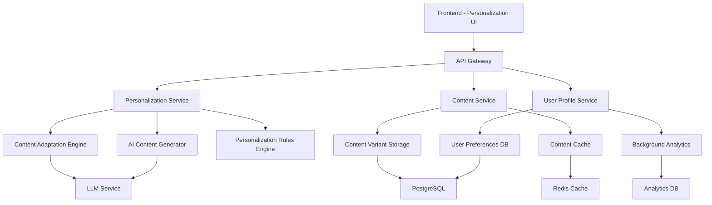

# User-Centric Content Personalization - Implementation Plan

**Feature**: `005-user-centric-content-personalization`  
**Date**: 2025-12-07  
**Plan Version**: 1.0  

## Executive Summary

This implementation plan outlines the development of a comprehensive user-centric content personalization system that will adapt book chapter content based on users' software and hardware backgrounds. The system will be built in 5 phases over 10 weeks, integrating seamlessly with the existing authentication system and content delivery infrastructure.

## Project Scope

### In Scope
- User background collection during signup process
- Content personalization engine with AI-powered generation
- Chapter-level personalization controls and interface
- Preference management and update system
- Performance optimization and caching
- Analytics and monitoring for personalization effectiveness

### Out of Scope
- Complete content management system overhaul
- Advanced machine learning recommendation algorithms
- Multi-language content personalization
- Video or multimedia content personalization
- Third-party content integration

## Technical Architecture Overview

### System Components

### Technology Stack

#### Backend Services
- **Language**: Python 3.11+ with FastAPI
- **Database**: PostgreSQL for user preferences and content variants
- **Cache**: Redis for content caching and session management
- **AI/LLM**: Integration with existing Gemini API for content generation
- **Message Queue**: Redis for async content processing
- **Monitoring**: Prometheus + Grafana for metrics

#### Frontend Components
- **Framework**: React with TypeScript (existing stack)
- **State Management**: React Context + Custom hooks
- **UI Components**: Existing component library + new personalization widgets
- **Styling**: CSS modules with existing design system

#### Infrastructure
- **Containerization**: Docker for service deployment
- **Orchestration**: Docker Compose for local development
- **API Documentation**: OpenAPI/Swagger for service documentation
- **Testing**: pytest for backend, Jest/React Testing Library for frontend

## Implementation Phases

### Phase 1: Foundation and User Background Collection (Weeks 1-2)

#### Week 1: Architecture Setup and Database Design
**Objectives:**
- Set up personalization service architecture
- Design and implement database schema
- Create basic API structure

**Deliverables:**
- Personalization service skeleton with FastAPI
- Database schema for user preferences and content variants
- Basic API endpoints for preference management
- Docker setup for local development

**Key Tasks:**
1. Create personalization microservice structure
2. Design user preference data models
3. Implement database migrations
4. Set up API routing and middleware
5. Create development environment configuration

#### Week 2: Signup Integration and Preference Collection
**Objectives:**
- Integrate background collection into signup flow
- Implement preference validation and storage
- Create basic preference management APIs

**Deliverables:**
- Enhanced signup form with background collection
- Preference validation and categorization logic
- RESTful APIs for preference CRUD operations
- Basic error handling and logging

**Key Tasks:**
1. Extend user registration form with background fields
2. Implement preference validation logic
3. Create preference storage and retrieval APIs
4. Add preference update functionality
5. Implement basic security and validation

### Phase 2: Core Personalization Engine (Weeks 3-4)

#### Week 3: Content Adaptation Engine
**Objectives:**
- Implement core personalization logic
- Create content adaptation rules
- Build content variant management

**Deliverables:**
- Content adaptation engine with rule-based personalization
- Content variant storage and retrieval system
- Basic personalization API endpoints
- Content tagging and categorization system

**Key Tasks:**
1. Implement personalization rules engine
2. Create content variant data models
3. Build content adaptation algorithms
4. Implement content tagging system
5. Create content variant management APIs

#### Week 4: Personalization API and Caching
**Objectives:**
- Complete personalization API development
- Implement caching for performance
- Add content fallback mechanisms

**Deliverables:**
- Complete personalization API with all endpoints
- Redis caching for personalized content
- Fallback content delivery system
- Performance optimization and monitoring

**Key Tasks:**
1. Complete all personalization API endpoints
2. Implement Redis caching strategy
3. Add content fallback mechanisms
4. Optimize database queries and performance
5. Add monitoring and logging

### Phase 3: User Interface and Controls (Weeks 5-6)

#### Week 5: Chapter Personalization Controls
**Objectives:**
- Implement chapter-level personalization UI
- Create personalization widget component
- Integrate with existing chapter rendering

**Deliverables:**
- Personalization widget for chapter start
- Content preview functionality
- Integration with existing chapter components
- Responsive design for all devices

**Key Tasks:**
1. Design and implement personalization widget
2. Create content preview components
3. Integrate with existing chapter rendering system
4. Implement responsive design
5. Add accessibility features

#### Week 6: Preference Management Interface
**Objectives:**
- Create comprehensive preference management UI
- Implement real-time content updates
- Add user feedback mechanisms

**Deliverables:**
- Complete preference management interface
- Real-time content update functionality
- User feedback and rating system
- Profile integration with existing user dashboard

**Key Tasks:**
1. Build preference management dashboard
2. Implement real-time content updates
3. Create user feedback collection system
4. Integrate with existing user profile system
5. Add help and documentation

### Phase 4: AI Content Generation (Weeks 7-8)

#### Week 7: AI Integration and Content Generation
**Objectives:**
- Integrate AI service for content generation
- Implement quality assurance for generated content
- Create content generation workflows

**Deliverables:**
- AI-powered content generation system
- Content quality assurance mechanisms
- Automated content generation workflows
- Generated content caching and storage

**Key Tasks:**
1. Integrate with Gemini API for content generation
2. Implement content generation prompts and templates
3. Create quality assurance and validation system
4. Build content generation workflows
5. Implement generated content caching

#### Week 8: Content Quality and Optimization
**Objectives:**
- Optimize AI content generation
- Implement content review and approval
- Add content versioning and rollback

**Deliverables:**
- Optimized content generation with quality controls
- Content review and approval workflow
- Content versioning and rollback system
- Performance optimization for AI operations

**Key Tasks:**
1. Optimize AI prompts and generation quality
2. Implement content review workflow
3. Add content versioning and rollback
4. Optimize performance for AI operations
5. Add monitoring for AI service usage

### Phase 5: Testing, Optimization, and Launch (Weeks 9-10)

#### Week 9: Comprehensive Testing
**Objectives:**
- Complete end-to-end testing
- Performance testing and optimization
- Security testing and validation

**Deliverables:**
- Complete test suite with high coverage
- Performance benchmarks and optimizations
- Security audit and validation
- Load testing results and improvements

**Key Tasks:**
1. Implement comprehensive unit and integration tests
2. Conduct performance testing and optimization
3. Perform security audit and penetration testing
4. Execute load testing and scalability validation
5. Fix identified issues and optimize performance

#### Week 10: User Acceptance Testing and Launch Preparation
**Objectives:**
- Conduct user acceptance testing
- Prepare for production deployment
- Create documentation and training materials

**Deliverables:**
- User acceptance testing results and fixes
- Production deployment configuration
- Complete documentation and user guides
- Monitoring and alerting setup

**Key Tasks:**
1. Conduct user acceptance testing with beta users
2. Prepare production deployment configuration
3. Create user documentation and help guides
4. Set up production monitoring and alerting
5. Plan and execute production deployment

## Resource Requirements

### Development Team
- **Backend Developer** (1 FTE): Personalization service, APIs, AI integration
- **Frontend Developer** (1 FTE): UI components, personalization controls, user experience
- **Full-Stack Developer** (0.5 FTE): Integration, testing, deployment support
- **DevOps Engineer** (0.25 FTE): Infrastructure, deployment, monitoring setup
- **QA Engineer** (0.5 FTE): Testing, quality assurance, user acceptance testing

### Infrastructure Requirements
- **Development Environment**: Enhanced with personalization services
- **Staging Environment**: Full replica for testing and validation
- **Production Environment**: Scalable infrastructure for personalization services
- **AI Service Credits**: Budget for Gemini API usage and content generation
- **Monitoring Tools**: Enhanced monitoring for personalization metrics

## Risk Management

### Technical Risks

#### High Priority Risks
1. **AI Content Quality Risk**
   - *Risk*: Generated content may be inaccurate or inconsistent
   - *Impact*: Poor user experience and reduced trust
   - *Mitigation*: Implement robust quality checks, human review process, and user feedback loops
   - *Contingency*: Fallback to pre-written content variants

2. **Performance Impact Risk**
   - *Risk*: Personalization may significantly slow content delivery
   - *Impact*: Poor user experience and increased bounce rates
   - *Mitigation*: Aggressive caching, performance optimization, and load testing
   - *Contingency*: Simplified personalization with reduced features

3. **Integration Complexity Risk**
   - *Risk*: Complex integration with existing systems may cause issues
   - *Impact*: Delays in delivery and potential system instability
   - *Mitigation*: Incremental integration, thorough testing, and rollback plans
   - *Contingency*: Phased rollout with feature flags

#### Medium Priority Risks
4. **User Adoption Risk**
   - *Risk*: Users may not engage with personalization features
   - *Impact*: Low ROI and reduced feature value
   - *Mitigation*: User research, intuitive design, and onboarding guidance
   - *Contingency*: Enhanced user education and incentives

5. **Content Maintenance Risk**
   - *Risk*: Maintaining multiple content variants may be resource-intensive
   - *Impact*: High operational costs and content quality issues
   - *Mitigation*: AI-assisted content generation and automated tools
   - *Contingency*: Reduced personalization scope and automated content management

### Business Risks

#### Privacy and Compliance Risk
- *Risk*: User privacy concerns about background data collection
- *Impact*: Reduced user adoption and potential compliance issues
- *Mitigation*: Clear privacy policy, optional data collection, and GDPR compliance
- *Contingency*: Anonymous personalization based on behavior patterns

#### Scalability Risk
- *Risk*: System may not scale with user growth
- *Impact*: Performance degradation and user experience issues
- *Mitigation*: Scalable architecture design and load testing
- *Contingency*: Horizontal scaling and performance optimization

## Success Metrics and KPIs

### User Engagement Metrics
- **Chapter Completion Rate**: Target 40% increase from baseline
- **Time Spent Reading**: Target 25% increase in average reading time
- **User Return Rate**: Target 30% increase in weekly active users
- **Personalization Usage**: Target 70% of users actively using personalization

### Technical Performance Metrics
- **Content Personalization Response Time**: <2 seconds (95th percentile)
- **System Availability**: 99.9% uptime for personalization services
- **Cache Hit Rate**: >80% for personalized content requests
- **AI Content Generation Time**: <5 seconds for new content variants

### Business Impact Metrics
- **User Satisfaction**: Target 85% satisfaction with content relevance
- **Preference Completion**: Target 90% of users complete background information
- **Support Requests**: <5% increase in personalization-related support tickets
- **Content Engagement**: Target 50% increase in content interaction rates

## Quality Assurance Strategy

### Testing Approach
1. **Unit Testing**: 90%+ code coverage for all personalization components
2. **Integration Testing**: End-to-end testing of personalization workflows
3. **Performance Testing**: Load testing with 1000+ concurrent users
4. **Security Testing**: Penetration testing and vulnerability assessment
5. **User Acceptance Testing**: Beta testing with representative user groups

### Quality Gates
- All tests must pass before deployment to staging
- Performance benchmarks must be met before production deployment
- Security audit must be completed and approved
- User acceptance criteria must be validated by product team

## Deployment Strategy

### Deployment Phases
1. **Development Deployment**: Continuous deployment to development environment
2. **Staging Deployment**: Weekly deployments for testing and validation
3. **Beta Deployment**: Limited production deployment for beta users
4. **Production Deployment**: Phased rollout with feature flags
5. **Full Rollout**: Complete deployment after validation

### Rollback Plan
- Feature flags for immediate personalization disable
- Database rollback procedures for preference data
- Content variant rollback to previous versions
- Service rollback to previous stable versions

## Monitoring and Maintenance

### Monitoring Strategy
- **Application Monitoring**: Performance metrics, error rates, and response times
- **Business Monitoring**: User engagement, personalization usage, and satisfaction
- **Infrastructure Monitoring**: System resources, database performance, and cache efficiency
- **AI Service Monitoring**: Content generation quality, API usage, and costs

### Maintenance Plan
- **Regular Updates**: Monthly updates for personalization rules and content variants
- **Performance Optimization**: Quarterly performance reviews and optimizations
- **Security Updates**: Regular security patches and vulnerability assessments
- **Content Quality Review**: Ongoing review of AI-generated content quality

## Documentation Requirements

### Technical Documentation
- API documentation with OpenAPI/Swagger specifications
- Database schema documentation and migration guides
- Deployment and configuration documentation
- Troubleshooting and maintenance guides

### User Documentation
- User guide for personalization features
- Help documentation for preference management
- FAQ for common personalization questions
- Video tutorials for key features

### Process Documentation
- Content creation guidelines for personalized variants
- Quality assurance procedures for AI-generated content
- Incident response procedures for personalization issues
- Change management process for personalization rules

---

**Plan Approval**
- **Plan Author**: AI Development Team
- **Technical Review**: Engineering Lead
- **Product Review**: Product Manager
- **Final Approval**: Project Sponsor
- **Approved Date**: 2025-12-07